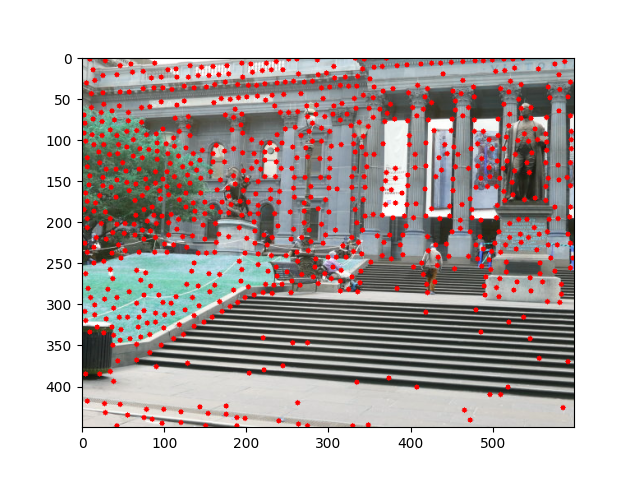
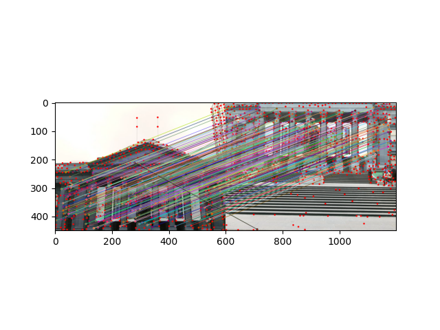
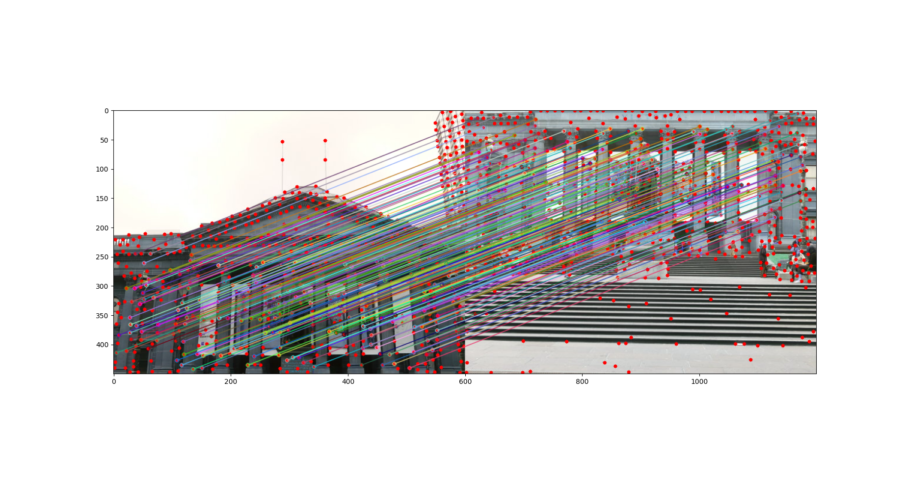
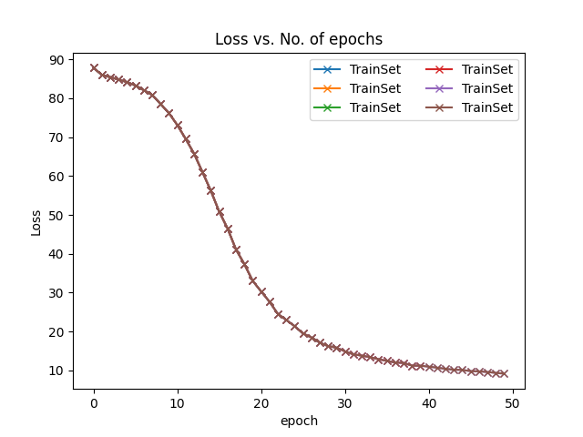

# My AutoPano
The purpose of this project is to stitch two or more images to create one seamless panorama image by finding the Homography between the two images. 

The project is divided into two parts,
1. Phase 1: Classical approach of local feature matching
2. Phase 2: Deep Learning approach(Homography Net - supervised) to estimate the homography.

## **Phase 1 - Using Classical CV **
Implemented traditional CV pipeline combines algorithms of corner detection, ANMS, feature extraction,
feature matching, RANSAC, homography estimation and blending.

### Results

#### Corner Detection and Non Maximal Suppression
<p align="center">
  
</p>


#### Feature Matching
<p align="center">
  
</p>


#### Outlier Rejection using RANSAC
<p align="center">
  
</p>


#### Warping, Blending and Stitching

<p align="center">
  
</p>


### Usage Guidelines

1. Open directory Phase1/Code and run the following command with the Data location as command line argument: -

    ```
    python Wrapper.py --DataPath Set2
    ```

    The above command will load Set2 images that need to be stitched.

2. The `Results` folder contains stitched images of all Trainsets and TestSets.
   

## **Phase 2 - using Deep Learning**
In Deep learning, used Homography Net (supervised) to estimate the homography.

### DataSet Generation
To generate the dataset, run the following command in Phase2/Code/supervised: -
    ```
    python Wrapper.py
    ```

### Supervised Homography

#### Result

##### Training Loss
<p align="center">
  
</p>


1. To train the network, run: -
    ```
    python Train.py
    ```

2. To test the model on the test set, run: -
    ```
    python Test.py
    ```

## References

1. https://rbe549.github.io/fall2022/hw/hw0/

